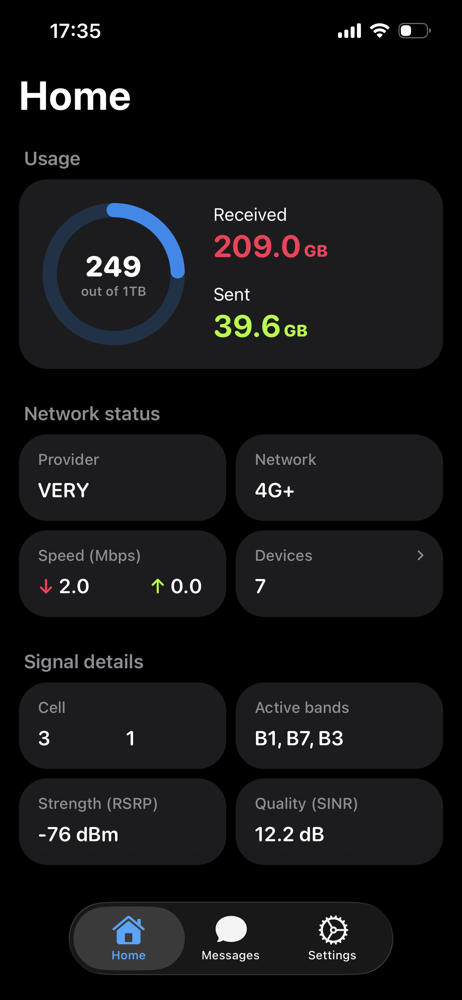
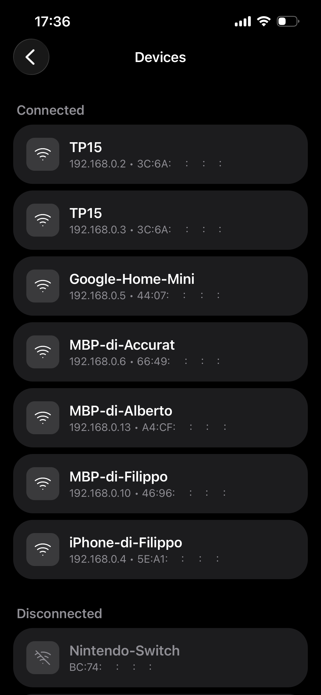
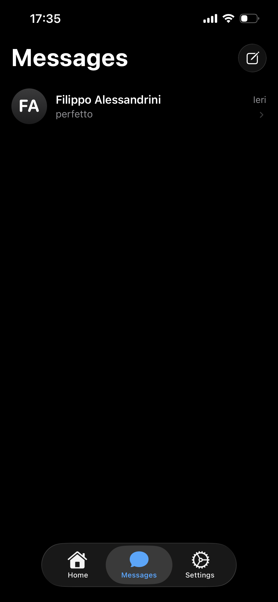
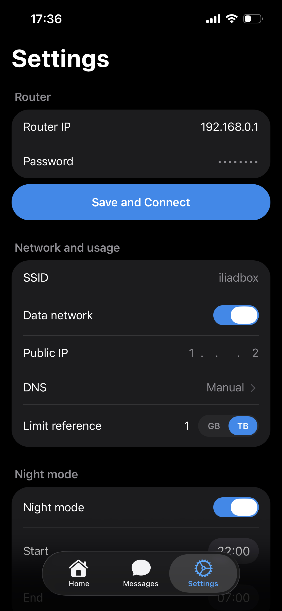
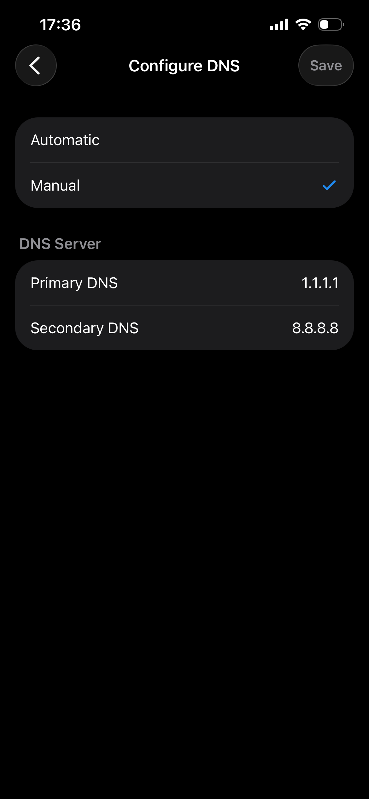

# Routy

Routy is an iOS-first Expo client designed to interface with ZTE routers. It allows to manage SMS messages and monitor device status directly from your smartphone without using the router's web interface.

## Overview

The application connects to the ZTE router over the local network using its internal API. It provides a native messaging experience, background monitoring for new messages, a real-time dashboard for network statistics and other settings such as manual
DNS configuration, device management and Night Mode.

## Key Features

- **SMS Management**: Read, send and delete SMS messages with a native mobile interface.
- **Background Monitoring**: Periodic background polling for new messages with local system notifications (using `expo-background-fetch`).
- **Network Dashboard**: Real-time monitoring of signal strength (RSRP/SINR), active bands (Carrier Aggregation support), connected cell ID and network status.
- **Data Tracking**: Monthly data usage visualization and real-time throughput monitoring.
- **Device Management**: View and monitor all devices currently connected to the router's network.
- **Privacy Focused**: Every communication happens between the smartphone and the router: nothing gets out of your network, and the router's password is only saved locally on your own device.

## How it Works

The app interacts with the ZTE router's `goform` API. It handles authentication, session management and data parsing locally.

## Tech Stack

- **Framework**: [Expo](https://expo.dev) (React Native)
- **Navigation**: Expo Router (File-based routing)
- **Styling**: Focus on native iOS UI components
- **Animations**: React Native Reanimated
- **Storage**: AsyncStorage for local credentials and message tracking
- **Background Tasks**: Expo Task Manager & Background Fetch for SMS notifications

## Requirements

- A compatible ZTE router (only tested on MF289F).
- The smartphone must be connected to the router's Wi-Fi network.
- Local Network permissions must be granted to allow communication with the router.

## Execute a Debug Build

1. Install dependencies:

   ```bash
   npm install
   ```

2. Run on a physical device (recommended for testing your own changes to the code):

   ```bash
   npx expo run:ios --device
   ```

## Execute a Release Build

1. Install dependencies:

   ```bash
   npm install
   ```

2. Run on a physical device (recommended for everyday use):

   ```bash
   npx expo run:ios --device --configuration Release
   ```

## Screenshots

<div align="center" style="display: flex; flex-wrap: wrap; justify-content: center; gap: 2%; width: 100%;">
  
  
  
  
  
  
</div>

---

_Note: This is a third-party application and is not affiliated with ZTE Corporation._
